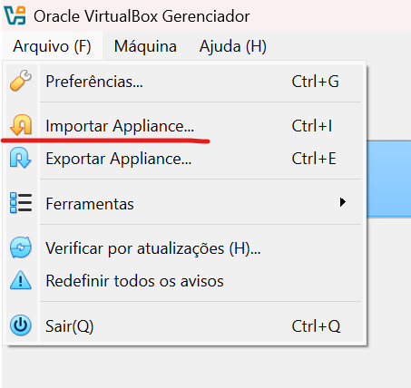
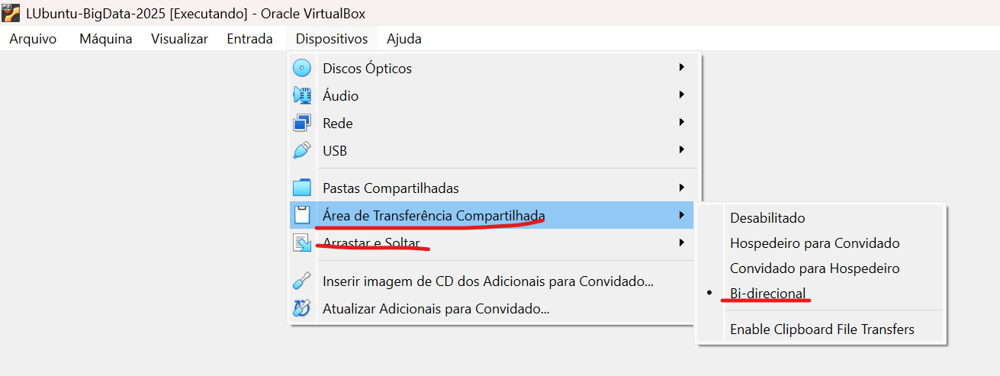
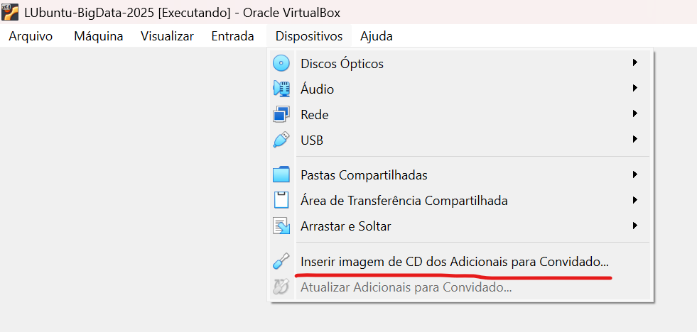
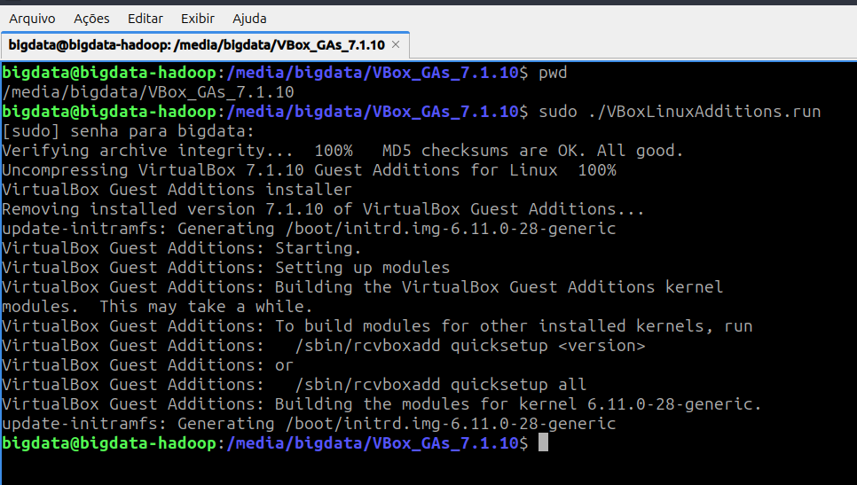
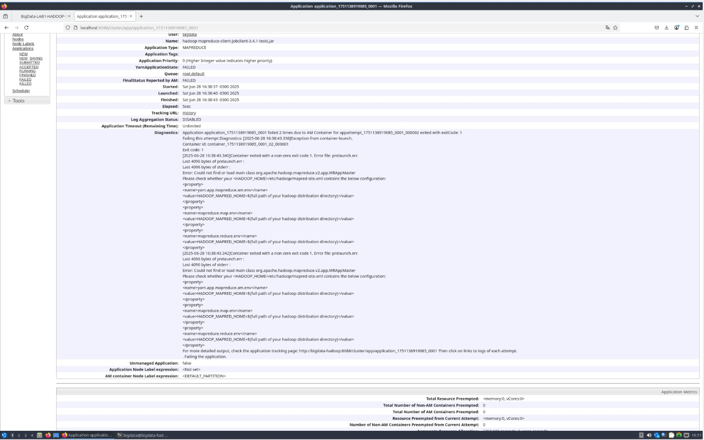
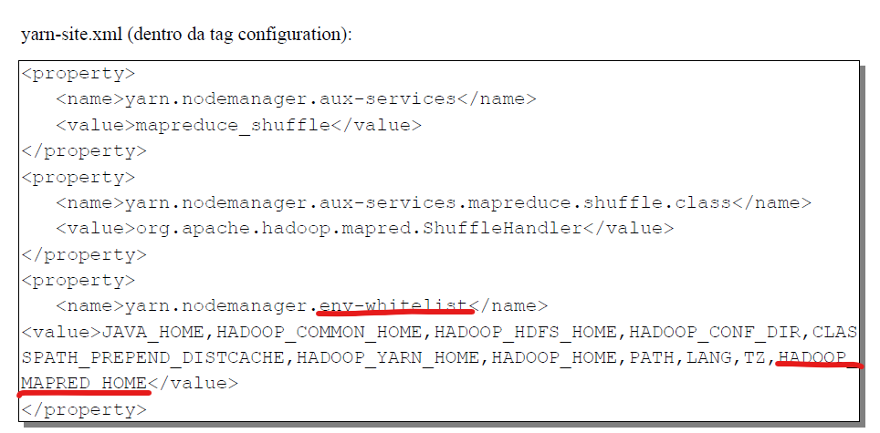
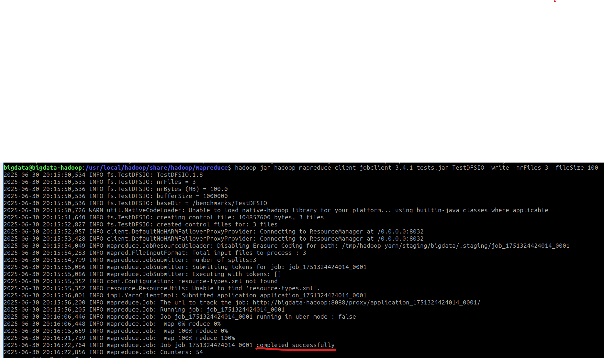
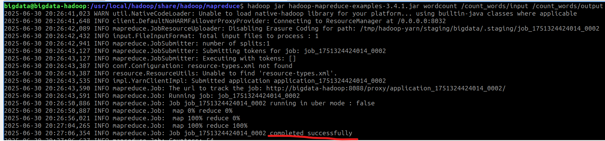

# Título: Relatório o instalação hadoop máquina virtual
## Aluno: Rafael De Pauli Baptista
## Disciplina: Introdução a Big Data

Relatório detalhando a instalação do ambiente single-node do hadoop em uma máquina virtual sendo rodada na solução VirtualBox da Oracle.

## Recursos utilizados:

- [VirtualBox](https://www.virtualbox.org/wiki/Downloads);
- [Imagem](https://drive.google.com/file/d/1w-MZMjghnGf_4zJwyx-D7z6JfIKg_E47/view?usp=sharing) de uma máquina virtual contendo a versão Linux LUbuntu;
- [Hadoop](https://hadoop.apache.org/releases.html). Para esse processo, foi utilizada a versão 3.3.1;

## Procedimento:

### 1. Instalação do VirtualBox

Primeiramente foi realizado download e a instalação do software VirtualBox para podermos rodar a máquina virtual disponibilizada pelo professor.

### 2. Importação e configuração da imagem da máquina virtual

- Importar a imagem da máquina virtual para o VirtualBox;
  

- Iniciar máquina virtual;
- Para facilitar a configuração do ambiente, foi habilitado as funcionalidades **Área de Transferência Compartilhada** e **Arrastar e Soltar**;
  - Para isso, primeiramente foi habilitado as devidas opções no software VirtualBox;

  - Após isso foi necessário instalar alguns pacotes adicionais na máquina virtual;
    - Inserir imagem de CD dos Adicionais para Convidados

    - Executar comando `$ sudo /media/<USER>/VBox_GAs_7.1.10/VBoxLinuxAdditions.run`

### 3. Instalação do Hadoop

Devido a diferentes versões do manual de instalação do hadoop (um disponibilizado no Moodle e outro pelo Whatsapp), foi encontrado o seguinte problema no momento de rodar o teste `$ hadoop jar hadoop-mapreduce-client-jobclient-3.4.1-tests.jar TestDFSIO -write -nrFiles 5 -fileSize 10`

O erro era devido a configuração do arquivo **yarn-site.xml**.

A solução do problema foi na edição correta do arquivo **yarn-site.xml**. Abaixo destaco o trecho do arquivo que corrigiu o problema:

### 4. Evidências teste TestDFSIO

Segue abaixo imagens evidenciando o sucesso da instalação do hadoop:

### 5. Evidências teste WordCount

Para realizar o teste do WordCount, foi utilizado o [tutorial](https://blog.devgenius.io/performing-word-count-with-hadoop-a-step-by-step-guide-0a44bc2adb68).

Segue abaixo imagens evidenciando o sucesso da instalação do hadoop:

