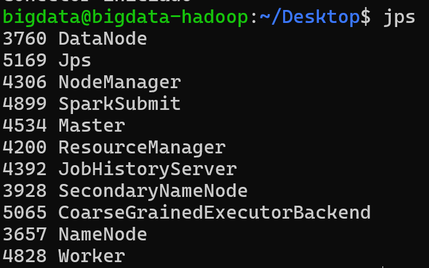

# Título: Relatório instalação e configuração ambiente cluster Spark

## Aluno: Rafael De Pauli Baptista

## Disciplina: Introdução a Big Data

Relatório detalhando a instalação e configuração de um cluster Spark.
Esse cluster é constituido de dois workers, sendo eles:

1 - Máquina virtual no ambiente VirtualBox preparada no exercício 1 da matéria;

2 - WSL (Windows Subsystem for Linux).

## Recursos utilizados:

- Máquina virtual no ambiente VirtualBox preparada no exercício 1 da matéria;
- [spark-3.5.6-bin-hadoop3](https://spark.apache.org/news/spark-3-5-6-released.html)

## Procedimento:

### 1. Instalação do Spark 3.5.6

No exercício 1 da matéria, foi preparado um ambiente com a versão Java 1.8 e Hadoop 3.3.1.
Devido a isso, foi utilizado a versão Spark 3.5.6 para manter a compatibilidade com o ambiente já preparado.
A versão Spark 4.0.0 possui a dependência da versão Java 17 ou posterior.

#### 1.1. Configuração do Hadoop 3.3.1 na na máquina virtual no ambiente VirtualBox

Saindo da premissa que o Hadoop 3.3.1 foi pré-instalado na máquina virtual do ambiente VirtualBox, realizar os seguintes ajustes:

- Editar arquivo **$HADOOP_HOME/etc/hadoop/core-site.xml**:

```xml
<configuration>
        <property>
                <name>fs.defaultFS</name>
                 <value>hdfs://192.168.0.13:9000</value>
        </property>
</configuration>
```

- Editar arquivo **$HADOOP_HOME/etc/hadoop/hdfs-site.xml**:

```xml
<configuration>
        <property>
                <name>dfs.replication</name>
                <value>1</value>
        </property>
        <property>
                <name>dfs.namenode.name.dir</name>
                <value>file:/usr/local/hadoop/hadoop_data/hdfs/namenode</value>
        </property>
        <property>
                <name>dfs.datanode.data.dir</name>
                <value>file:/usr/local/hadoop/hadoop_data/hdfs/datanode</value>
        </property>

        <!-- Trecho abaixo inserido para funcionar em cluster -->
        <property>
                <name>dfs.datanode.ipc.address</name>
                <value>192.168.0.13:9867</value> </property>
        <property>
                <name>dfs.datanode.http.address</name>
                <value>192.168.0.13:9864</value>
        </property>
        <property>
                <name>dfs.datanode.address</name>
                <value>192.168.0.13:9866</value>
        </property>
</configuration>
```

- Editar arquivo **$HADOOP_HOME/etc/hadoop/yarn-site.xml**:

```xml
<configuration>
        <property>
                <name>yarn.resourcemanager.hostname</name>
                <value>192.168.0.13</value>
        </property>
        <property>
                <name>yarn.nodemanager.aux-services</name>
                <value>mapreduce_shuffle</value>
        </property>
        <property>
                <name>yarn.nodemanager.aux-services.mapreduce.shuffle.class</name>
                <value>org.apache.hadoop.mapred.ShuffleHandler</value>
        </property>
        <property>
                <name>yarn.nodemanager.env-whitelist</name>
                <value>JAVA_HOME,HADOOP_COMMON_HOME,HADOOP_HDFS_HOME,HADOOP_CONF_DIR,CLASSPATH_PREPEND_DISTCACHE,HADOOP_YARN_HOME,HADOOP_HOME,PATH,LANG,TZ,HADOOP_MAPRED_HOME</value>
        </property>
</configuration>
```

**Obs:** O IP da máquina configurada é o 192.168.0.13 (máquina virtual do ambiente VirtualBox). Esse IP deve ser alterado conforme o IP da máquina virtual do ambiente VirtualBox.

Essas configurações darão embasamento para a correta instalação e execução do Spark 3.5.6 no modo cluster.

#### 1.2. Instalação Spark Master e Worker na máquina virtual no ambiente VirtualBox

- Realizar download do spark-3.5.6-bin-hadoop3;
- Copiar o arquivo para o diretório `$ sudo cp spark-3.5.6-bin-hadoop3.tar.gz /usr/local`;
- Acessar diretório `$ cd /usr/local` e descompactar o arquivo copiado `$ sudo tar -czfv spark-3.5.6-bin-hadoop3.tar.gz`;
- Editar arquivo **~/.bashrc** e adicionar as seguintes linhas:
  - `export SPARK_HOME=/usr/local/spark-3.5.6-bin-hadoop3/` 
  - `export PATH=$PATH:$SPARK_HOME/bin`
- Utilizar script abaixo para iniciar Spark Connector. Isso nos permitirá acessar remotamente o cluster Spark a partir de qualquer computador:

```bash
#!/bin/bash

# Este script inicia o Spark Connect Server com os pacotes e configurações corretas.

# Defina o caminho base da sua instalação do Spark
# Certifique-se de que este caminho está correto para a sua VM
SPARK_HOME="/usr/local/spark-3.5.6-bin-hadoop3"

# Defina o IP do seu Spark Master (o mesmo que você está usando para a UI e para conectar via PySpark)
SPARK_MASTER_IP="bigdata-hadoop"

# Porta padrão para o Spark Master
SPARK_MASTER_PORT="7077"

# Pacote do Spark Connect (verifique a versão exata se houver problemas)
# Geralmente, a versão do spark-connect_2.12 é a mesma da sua versão principal do Spark (ex: 3.5.x)
SPARK_CONNECT_PACKAGE="org.apache.spark:spark-connect_2.12:3.5.1"
# Se 3.5.1 não funcionar, tente 3.5.0 ou a versão exata do seu Spark (3.5.6)
# SPARK_CONNECT_PACKAGE="org.apache.spark:spark-connect_2.12:3.5.6"


echo "Iniciando o Spark Connect Server..."
echo "SPARK_HOME: $SPARK_HOME"
echo "Spark Master: spark://$SPARK_MASTER_IP:$SPARK_MASTER_PORT"
echo "Spark Connect Package: $SPARK_CONNECT_PACKAGE"

# Executa o script start-connect-server.sh com os parâmetros necessários
"$SPARK_HOME"/sbin/start-connect-server.sh \
  --packages "$SPARK_CONNECT_PACKAGE" \
  --master "spark://$SPARK_MASTER_IP:$SPARK_MASTER_PORT"

echo "Verifique o log para o status de inicialização do Spark Connect Server."
echo "O servidor deve estar escutando na porta 15002."
echo "Você pode verificar com: sudo netstat -tulnp | grep 15002"
```

- Iniciar ambiente Hadoop conforme descrito nas instruções do exercício 1 da matéria;

- Iniciar ambiente Spark Cluster:
  
  - `/usr/local/spark-3.5.6-bin-hadoop3/sbin/start-all.sh`;
  - Iniciar Spark Connector;

- Verificar execução do ambiente Spark Cluster:
  
  - Executar comando `$ jps` e verificar os processos Hadoop e Spark;
    
  
  - Verificar execução do Master, Worker e Spark Connector usando o UI do Spark:
    

#### 1.3. Instalação Spark Worker no WSL (Windows Subsystem for Linux)

Estamos saindo da premissa que o WSL (Windows Subsystem for Linux) foi pré-instalado na máquina hospedeira que roda o ambiente VirtualBox.
**Obs:** O IP da máquina virtual do ambiente VirtualBox configurada é o 192.168.0.13. Esse IP deve ser alterado conforme o IP da máquina virtual do ambiente VirtualBox detalhado no item **1.2**.

- Acessar diretório `$ cd /usr/local`;
- Copiar Hadoop configurado no passo 1.2 para o WSL `$sudo scp -r bigdata@192.168.0.13:/usr/local/hadoop ./`
- Copiar Spark configurado no passo 1.2 para o WSL `$sudo scp -r bigdata@192.168.0.13:/usr/local/spark-3.5.6-bin-hadoop3 ./`
- Acrescentar as seguintes configurações no arquivo **~/.bashrc**:

```bash
export JAVA_HOME="/usr/lib/jvm/java-11-openjdk-amd64"
export HADOOP_HOME=/usr/local/hadoop
export PATH=$PATH:$HADOOP_HOME/bin
export PATH=$PATH:$HADOOP_HOME/sbin
export HADOOP_COMMON_LIB_NATIVE_DIR=$HADOOP_HOME/lib/native
export HADOOP_OPTS="-Djava.library.path=$HADOOP_HOME/lib"
unset JAVA_TOOL_OPTIONS
export PDSH_RCMD_TYPE=ssh

# Config Spark
export SPARK_HOME=/usr/local/spark-3.5.6-bin-hadoop3/
export PATH=$PATH:$SPARK_HOME/bin
export PATH=$PATH:$SPARK_HOME/sbin
```

- **Obs:** Ajustar caminho da variável **JAVA_HOME** conforme o caminho da sua versão Java instalada no WSL. Vale lembrar que o ambiente preparado só funciona com a versão Java 1.8 ou 11.

- Testar conectividade hadoop `$ hdfs dfs -ls /`
  

- Iniciar Spark Worker `$ start-worker.sh spark://192.168.0.13:7077`
  
  - Endereço IP informado é do Spark Master configurado no item **1.2**.
  - Caso o WSL não consiga se conectar ao Spark Master, reiniciar interface de rede do WSL usando os comando que devem ser executados no prompt do **Windows**:
    - `DISM /Online /Enable-Feature /All /FeatureName:Microsoft-Windows-Subsystem-Linux`
    - `DISM /Online /Enable-Feature /All /FeatureName:VirtualMachinePlatform`
  - Verificar Spark Cluster possui 2 Workers usando o UI do Spark:
    

#### 1.4. Execução dos exercícios propostos

- Word Count Job em shell Scala


- Consultas sobre o CSV de Employees em PySpark


- Uso do PySpark em Notebooks Jupyter ou IDEs


